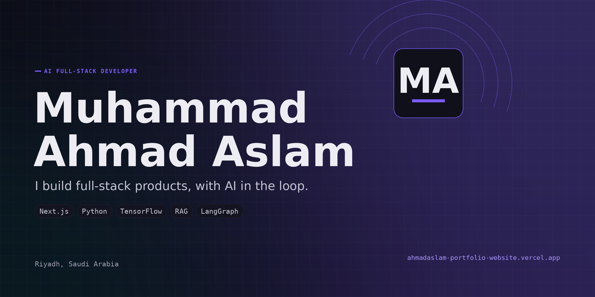

<div align="center">



<h1>Portfolio</h1>

<p><strong>The personal portfolio of Muhammad Ahmad Aslam: an AI full-stack developer who ships across the whole stack, from the interface down to the model serving it.</strong></p>

[](https://ahmadaslam-portfolio-website.vercel.app)
[](https://github.com/m-ahmadaslam/ahmadaslam-portfolio-website/actions/workflows/ci.yml)
[](LICENSE)

<a href="https://ahmadaslam-portfolio-website.vercel.app"><strong>Visit the site &rarr;</strong></a>

</div>

---

## What this is

A personal site built to do three things at once: stand as a personal brand, load fast on a phone, and still land an interactive 3D hero on a capable desktop. It runs on the Next.js App Router with a strict TypeScript codebase, a single content source of truth, and a contact pipeline that degrades gracefully. No site template, no page builder.

The visual architecture is adapted, with written permission, from [Sunny Patel's open-sourced portfolio](https://github.com/sunnypatell/Portfolio), then recolored into an "Obsidian Violet" theme and rebuilt around my own content, projects, and branding. A visible credit to Sunny is kept in the site footer.

## Highlights

- **An interactive 3D hero** gated by device capability, so phones and low-power machines get a static poster and never download the model, and the render loop pauses when it scrolls offscreen.
- **One content source of truth.** Every page, project, and piece of metadata reads from a single typed content module (`src/content/site.ts`), so the site cannot drift out of sync with itself.
- **A resilient contact form.** It delivers mail client-side through EmailJS, screens with a honeypot, optionally verifies reCAPTCHA v3, and shows a plain email fallback when no keys are configured. It also fires a non-blocking POST to an optional `/api/contact` route that stays inert until you point it at a database.
- **SEO handled at the framework level:** per-route metadata, Open Graph and Twitter cards, JSON-LD, a generated sitemap and robots, and a dynamic social image.
- **Accessibility as a baseline:** a skip link, a focus ring that stays visible on every surface, managed focus on the mobile menu, semantic landmarks, and full reduced-motion support down to disabling smooth scroll.

## Why this stack

Chosen for a content site that has to be cheap to serve under traffic, rank well, and still host real interactivity. It is not framework-by-default.

| Layer | Choice | Why |
| --- | --- | --- |
| Framework | **Next.js (App Router)** | Server Components for fast first paint, file-based metadata, sitemap, robots, and social image so SEO is native rather than bolted on, static rendering for content routes, and built-in image optimization to keep data transfer low. |
| UI | **React + TypeScript (strict)** | Concurrent React with strict types, so the single content source stays honest. |
| 3D | **React Three Fiber + drei** | Declarative Three.js for the hero, lazy-loaded and gated by device capability. |
| Motion | **GSAP + Lenis** | One shared animation loop drives smooth scroll and scroll-triggered timelines together, and both stand down under reduced motion. |
| Styling | **Tailwind CSS** | CSS-first design tokens with no runtime, one source for the palette. |
| Validation | **Zod** | Schema validation at the contact form and the optional API boundary. |
| Analytics | **Vercel Analytics + Speed Insights** | Lightweight, privacy-friendly, real-user metrics. |

## Running locally

Use the Node version pinned in `.nvmrc`.

```bash
npm install
cp .env.example .env.local   # optional, see the file for what each value does
npm run dev
```

Lint and a production build:

```bash
npm run lint
npm run build
```

### Optional: persisting contact submissions

The contact form works with zero backend. If you want to store submissions
server-side, add exactly one connection string to `.env.local`
(`MONGODB_URI`, `DATABASE_URL` for Neon/Postgres, or `SUPABASE_URL` +
`SUPABASE_SERVICE_ROLE_KEY`), install that vendor's driver, and uncomment the
matching adapter in [`src/app/api/contact/route.ts`](src/app/api/contact/route.ts).
Until then the route validates input and returns success without storing anything.

## Performance and accessibility

Imagery is served as WebP through the framework's image pipeline with explicit dimensions, so the layout never shifts and only the right size ships per viewport. The 3D scene and its model download only on capable, in-view devices. Smooth scroll, parallax, and scroll-triggered reveals all respect reduced motion, and keyboard paths are first-class: a skip link, a focus ring that clears contrast on any background, and focus trapping with restoration on the mobile menu.

## Credit

The underlying design and front-end architecture are adapted from **[Sunny Patel](https://github.com/sunnypatell)**'s portfolio, used with his written permission. All content, copy, imagery, project write-ups, and the Obsidian Violet color design are my own.

## License

Source-available, not open-source. You are welcome to read and learn from the code; please do not redeploy it as your own site or reuse the content, design, or personal branding of either author. See [LICENSE](LICENSE).

## Citation

If you reference this project, see [CITATION.cff](CITATION.cff) or use GitHub's "Cite this repository".

## Author

<table>
  <tr>
    <td>
      <strong>Muhammad Ahmad Aslam</strong><br/>
      AI full-stack developer, Riyadh, Saudi Arabia
    </td>
    <td>
      <a href="https://ahmadaslam-portfolio-website.vercel.app">Website</a> &middot;
      <a href="https://github.com/m-ahmadaslam">GitHub</a> &middot;
      <a href="https://www.linkedin.com/in/muhammad-ahmad-aslam">LinkedIn</a> &middot;
      <a href="mailto:muhammad.ahmadaslam2003@gmail.com">Email</a>
    </td>
  </tr>
</table>
